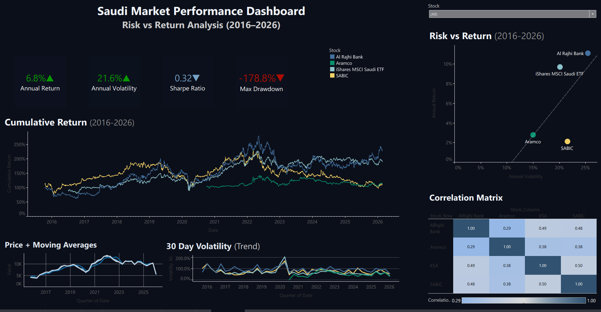

# saudi-market-dashboard
## Risk vs Return Analysis (2016–2026)

##  Dashboard Preview



---

## Executive Summary

This project presents a comprehensive risk–return analysis of selected Saudi market assets over the period 2016–2026. The objective is to evaluate how effectively major Saudi equities compensate investors for the level of risk undertaken, and to determine whether higher volatility consistently translates into superior returns.

By combining return metrics, volatility analysis, drawdown measurement, and cross-asset correlation, the dashboard provides a clear and accessible overview suitable for both technical and non-technical stakeholders.

---

## Project Objective

The primary goal of this analysis is to answer four core investment questions:

- Which asset delivered the strongest risk-adjusted performance?
- How volatile are leading Saudi blue-chip stocks over time?
- To what extent do these assets move together?
- What level of downside risk (maximum drawdown) did investors face?

Rather than focusing solely on raw returns, this project emphasizes risk-adjusted evaluation, which is critical in portfolio construction and capital allocation decisions.

---

## Data Source

Historical market data was retrieved using the Yahoo Finance API via the `yfinance` Python library.

The following instruments were analyzed:

- **2222.SR** — Saudi Aramco  
- **1180.SR** — Al Rajhi Bank  
- **2010.SR** — SABIC  
- **KSA** — iShares MSCI Saudi ETF  

The dataset includes adjusted daily closing prices beginning in 2015 to ensure sufficient lookback for rolling calculations and trend analysis.

---

## Methodology

The analysis follows a structured quantitative workflow:

### 1. Data Preparation
- Downloaded historical adjusted price data
- Removed missing values and ensured chronological consistency
- Structured dataset for multi-asset comparison

### 2. Return Calculations
- Computed daily returns
- Calculated cumulative returns to assess long-term growth
- Annualized returns using 252 trading days

### 3. Risk Metrics
- Annualized volatility (standard deviation of daily returns)
- 30-day rolling volatility to identify short-term risk spikes
- Maximum drawdown to measure peak-to-trough capital loss
- Sharpe Ratio (risk-free rate assumed at 0%) to evaluate risk-adjusted performance

### 4. Correlation Analysis
- Constructed a correlation matrix of daily returns
- Assessed diversification potential across assets

All calculations were performed using Python (Pandas, NumPy) to ensure reproducibility and transparency.

---

## Dashboard Design Philosophy

The dashboard was designed with clarity and executive communication in mind.

Key components include:

- **KPI Summary Cards** — Immediate snapshot of return, volatility, Sharpe ratio, and maximum drawdown.
- **Cumulative Return Chart** — Visual comparison of long-term capital growth.
- **Risk vs Return Scatter Plot** — Portfolio positioning framework.
- **Correlation Heatmap** — Diversification insight across assets.
- **Price with Moving Averages (20, 50, 200 days)** — Trend identification.
- **30-Day Rolling Volatility** — Detection of risk regime shifts.

Each visualization serves a distinct analytical purpose while remaining intuitive for decision-makers.

---

## Key Insights & Recommendations

Over the past decade, clear differences emerged in how each asset balanced risk and return.

Al Rajhi Bank stood out for delivering the most consistent risk-adjusted performance. While it experienced normal market fluctuations, its returns were more efficient relative to the level of volatility investors faced. From a portfolio perspective, this makes it a strong candidate as a core holding.

SABIC showed higher periods of volatility without generating proportionally stronger long-term returns. This suggests that taking additional risk did not necessarily result in better overall performance during the observed period.

The 2020 market disruption highlighted how quickly volatility can rise and how meaningful drawdowns can become during periods of global uncertainty. This reinforces the importance of monitoring downside risk rather than focusing only on average returns.

Correlation levels between the selected assets were moderate. While diversification within the Saudi market does provide some risk reduction, the benefit is limited due to shared macroeconomic exposure.

### Recommendations

For long-term investors, prioritizing assets with stronger risk-adjusted returns may lead to more stable portfolio growth than simply targeting higher raw returns.

Maintaining diversification remains important, but investors should also monitor volatility trends and potential drawdowns, especially during periods of economic stress.

Ultimately, disciplined risk management should guide allocation decisions as much as return expectations.

---

## Live Dashboard

🔗 https://public.tableau.com/views/SaudiMarketPerformance/Dashboard?:language=en-US&publish=yes&:sid=&:redirect=auth&:display_count=n&:origin=viz_share_link

The dashboard is interactive and allows users to explore performance metrics dynamically.

---

## Repository Structure

```
├── data_preparation.py
├── clean_stock_data.csv
├── correlation_matrix.csv
├── risk_summary.csv
├── README.md
```

---

## Assumptions & Limitations

- The risk-free rate is assumed to be 0% for Sharpe ratio calculations.
- The analysis is based solely on historical data.
- Adjusted prices account for corporate actions, but external macroeconomic factors are not explicitly modeled.
- Past performance does not guarantee future results.

---

## Tools & Technologies

- Python (Pandas, NumPy)
- yfinance API
- Data visualization platform (Tableau)
- GitHub for version control and project documentation

---

## Conclusion

This project demonstrates how quantitative financial analysis can be translated into a clear, decision-oriented dashboard. By combining statistical rigor with intuitive visualization, the dashboard bridges the gap between raw market data and actionable investment insight.
